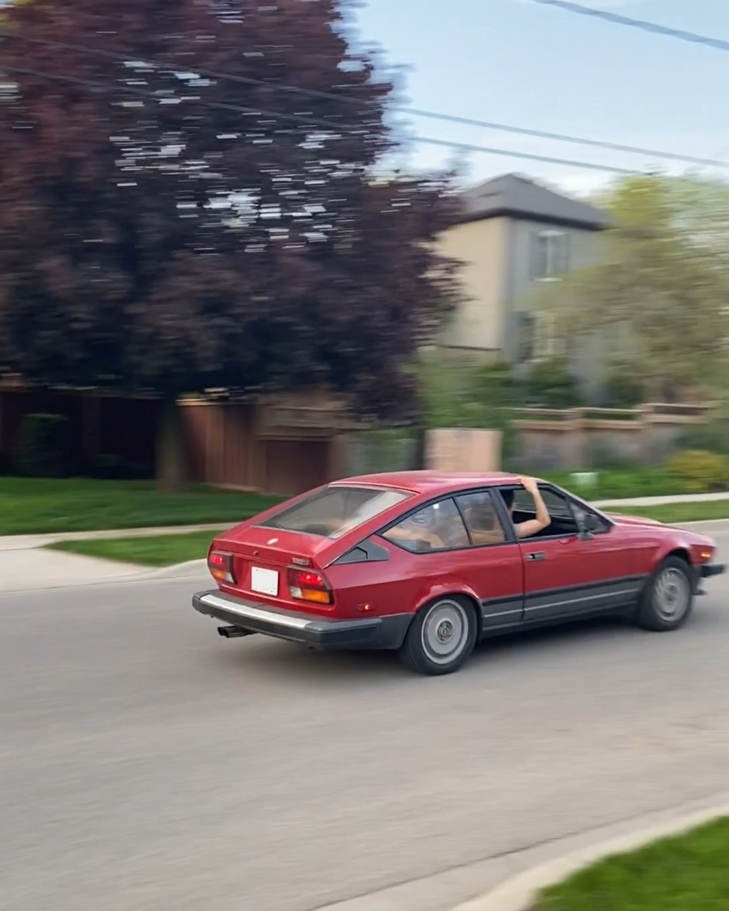
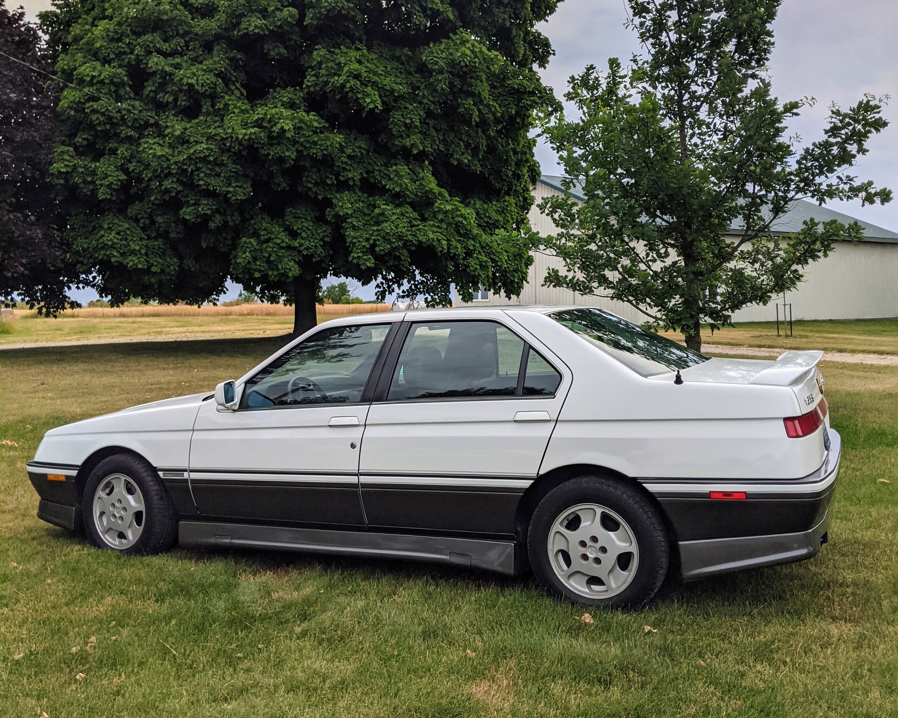

*1989 Porsche 944*

I've been fascinated with cars since I was a kid. I'm partial to older cars that offer pure mechanical input and feedback loops. Taking an old classic for a spirited drive is by far the most engaging and rewarding human-machine interaction I know of. That's only part of the picture though. In reality, the other half of the human-machine relationship is the time spent constantly wrenching on it in the garage. This mechanical interaction can be equally rewarding, but the rewards are much harder earned.

As years pass, the culmination of time spent in the car and underneath it forms a unique bond between man and machine. One where blood, sweat, and tears are quickly forgotten when the sound of the howling twin cam at the top of third gear reverberates down your spine and you reach for a quick downshift into a tightening bend, grinning like a kid again.

Today there's four cars in the collection.

*1983 Alfa Romeo GTV6*

*1985 Alfa Romeo Spider*

*1991 Alfa Romeo 164 S*
